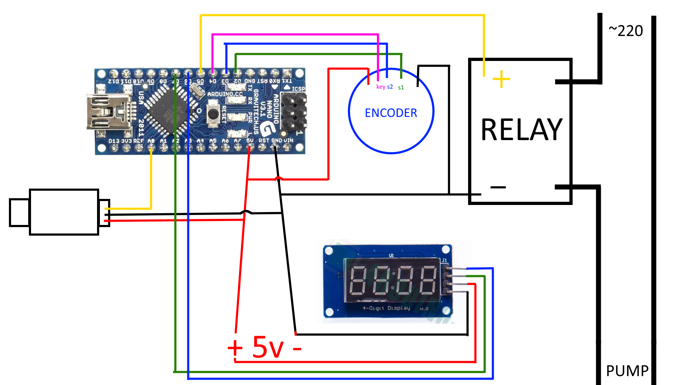

<h1 align="center">PumpController</h1>

  
  

## Content
* [Project description](#chapter-0)
* [Usage](#chapter-1)
* [Hardware](#chapter-2)
* [Libraries](#chapter-3)

## Project description

Arduino Controller for water pump

## Usage

1. Turn to change lower threshold
2. Hold and turn to change upper threshold
3. Hold to save thresholds to EEPROM
4. Click to display current pressure

### Scheme:

## Hardware

| Name                  |  Model                       |
| --------------------- | ---------------------------: |
| Controller            | [Arduino Nano ATmega328]()   |
| Encoder               | [EC11]()                     |
| Display               | [TM1637]()                   |
| Relay                 | [SSR-40DA]()                 |
| Pressure sensor       | [EBOWAN]()                   |

## Libraries

* [**GyverTM1637**](https://github.com/GyverLibs/GyverTM1637)
* [**EncButton**](https://github.com/GyverLibs/EncButton)

## ToDO
* create board on easyeda
* LGT8F328P
* average pressure

<h1 align="center"><a href="#top">▲</a></h1>
